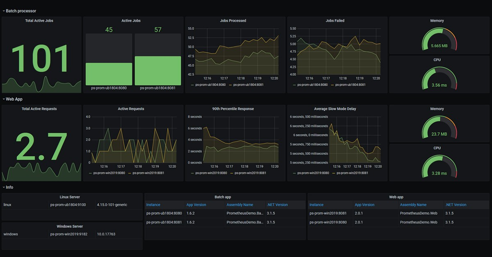
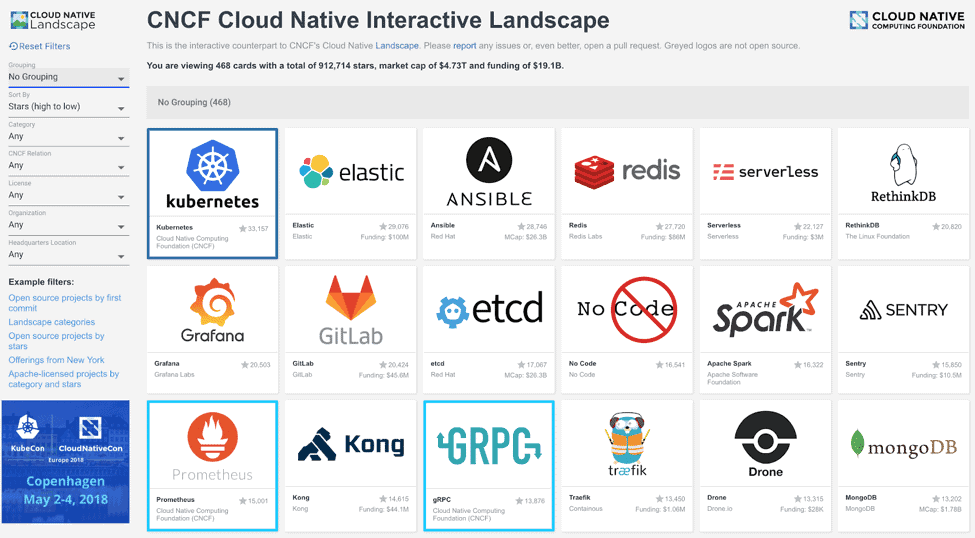
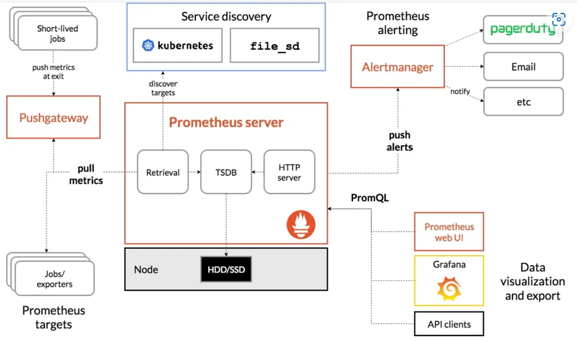
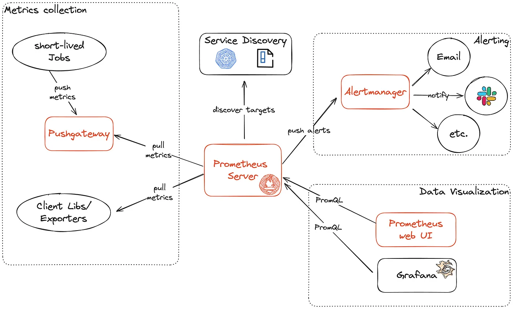
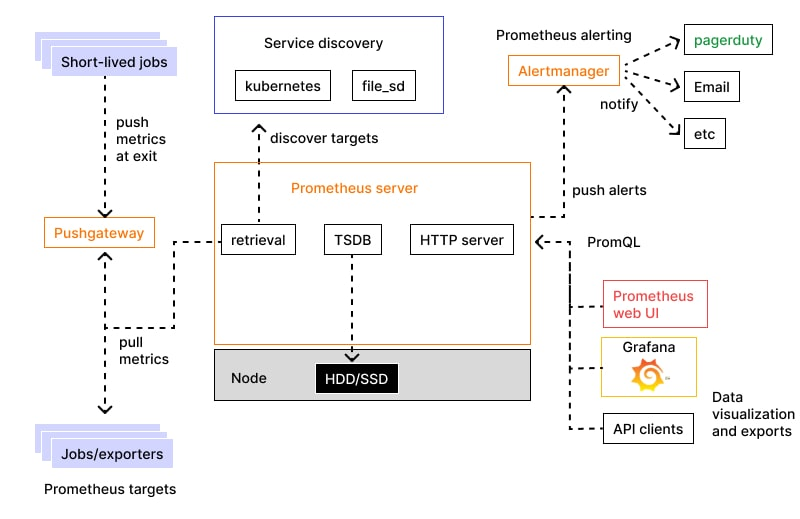

<!-- _class: lead -->
<!-- _paginate: false -->

# Powershell

---

## Sommaire

1. Introduction et bases de PowerShell
2. Manipulation avancée et scripting
3. Gestion des systèmes et des services Windows
4. Automatisation avancée
5. Réseaux et sécurité
6. Urbanisation du SI Hybride
7. Elements du Cloud Broker
8. Impact et grandes tendances

</div>

---

<!-- _class: lead -->
<!-- _paginate: false -->

## Introduction et bases de PowerShell

---

## Introduction et bases de PowerShell

### Introduction

<br/>

<div style="font-size:35px">

#### **1. Historique de PowerShell**
- **Origines :**
  - Créé par Microsoft pour fournir un shell en ligne de commande et un langage de script destiné à l’administration système.
  - Introduit pour la première fois en **2006** sous le nom **Monad** (nom de code).

</div>

---

## Introduction et bases de PowerShell

### Introduction

<div style="font-size:20px">

#### **1. Historique de PowerShell**

- **Évolutions :**
  - **PowerShell 1.0 (2006)** : Sortie initiale, intégrée à Windows Server 2008 et Windows Vista.
  - **PowerShell 2.0 (2009)** : Ajout de nombreuses fonctionnalités, dont PowerShell Remoting via WinRM.
  - **PowerShell 3.0 (2012)** : Intégré à Windows Server 2012 et Windows 8, avec une meilleure prise en charge des modules.
  - **PowerShell 4.0 (2013)** : Introduction de Desired State Configuration (DSC).
  - **PowerShell 5.0/5.1 (2016)** : Intégration avec Windows Management Framework (WMF), prise en charge des classes et des nouveaux cmdlets.
  - **PowerShell Core 6.x (2018)** : Passage à une version multiplateforme (Windows, Linux, macOS), basé sur .NET Core.
  - **PowerShell 7.x (2020)** : Version actuelle, entièrement multiplateforme, basée sur .NET 5/6, avec de meilleures performances et compatibilité accrue avec les scripts Windows PowerShell.

</div>

---


<div style="font-size:15px">

| Version             | Année de sortie | Nouveautés clés                                         | Compatibilité          |
|---------------------|-----------------|--------------------------------------------------------|-----------------------|
| PowerShell 1.0      | 2006            | Cmdlets de base, pipelines                             | Windows uniquement    |
| PowerShell 2.0      | 2009            | Remoting, modules                                      | Windows uniquement    |
| PowerShell 3.0      | 2012            | Améliorations des workflows, tâches planifiées         | Windows uniquement    |
| PowerShell 5.1      | 2016            | Classes, gestion des paquets, DSC amélioré            | Windows uniquement    |
| PowerShell Core 6.x | 2018            | Multiplateforme, open source                          | Windows, macOS, Linux |
| PowerShell 7.x      | 2020+           | Multiplateforme, basée sur .NET 5/6                   | Windows, macOS, Linux |


</div>

---

## Introduction et bases de PowerShell

#### Introduction

<div style="font-size:17px">

#### **3. Cas d’usage de PowerShell**
PowerShell est conçu pour répondre aux besoins d’administration et d’automatisation dans des environnements Windows et multiplateformes. Voici ses principaux cas d’usage :

1. **Administration système et automatisation :**
   - Gestion des utilisateurs et des groupes locaux et Active Directory.
   - Gestion des processus, services, et planification des tâches.
   - Surveillance et analyse des journaux d'événements.

2. **Gestion des fichiers et des dossiers :**
   - Création, copie, déplacement et suppression de fichiers et dossiers.
   - Recherche avancée dans les fichiers grâce aux filtres.
   - Analyse et transformation des données (CSV, JSON, XML).

3. **Gestion des infrastructures réseau :**
   - Configuration et surveillance des interfaces réseau.
   - Tests de connectivité et résolution DNS.
   - Automatisation des tâches réseau (paramétrage de pare-feu, VPN, etc.).
</div>

---


## Introduction et bases de PowerShell

#### Introduction

<div style="font-size:17px">

#### **3. Cas d’usage de PowerShell**

1. **Déploiement et configuration :**
   - Déploiement de logiciels via des scripts automatisés.
   - Configuration des serveurs avec **Desired State Configuration (DSC)**.
   - Automatisation des mises à jour et correctifs.

2. **Gestion de la sécurité :**
   - Audit des permissions sur les fichiers et dossiers.
   - Gestion des certificats numériques.
   - Création de scripts sécurisés et gestion des credentials.

3. **Intégration et gestion de Cloud :**
   - Interaction avec Azure, AWS, ou Google Cloud à travers leurs modules spécifiques.
   - Gestion des machines virtuelles et ressources cloud.

4. **Scripting multiplateforme :**
   - Grâce à PowerShell Core et PowerShell 7.x, gestion des systèmes Windows, Linux et macOS avec le même outil.
</div>

---

## Introduction et bases de PowerShell

#### Introduction

<div style="font-size:30px">

#### **Avantages de PowerShell**

- Basé sur **.NET Framework/Core** : permet de manipuler des objets directement au lieu de simples textes.
- **Extensibilité :** supporte des modules personnalisés et des API.
- **Interopérabilité :** fonctionne sur plusieurs plateformes et peut interagir avec d'autres outils comme Ansible, Terraform, etc.
- **Communauté active :** riche en modules préexistants sur des plateformes comme le **PowerShell Gallery**.

</div>

---

## Concepts et Enjeux

#### Signes avant coureurs du Cloud

<br/>

<div style="font-size:28px">

### **1. Pressions organisationnelles**
- **Demande d'agilité :** Les entreprises recherchent des solutions pour réduire les délais de mise sur le marché des produits et services.
- **Besoin de flexibilité :** Les équipes souhaitent des environnements scalables pour gérer des charges de travail fluctuantes.
- **Focus sur le cœur de métier :** Réduction des efforts consacrés à la gestion des infrastructures pour se concentrer sur les activités à forte valeur ajoutée.

---

## Concepts et Enjeux

#### Signes avant coureurs du Cloud

<br/>

<div style="font-size:28px">

### **2. Limitations des infrastructures traditionnelles**
- **Coûts élevés :** Les investissements CapEx liés aux datacenters deviennent difficilement justifiables face à l'évolution rapide des besoins.
- **Manque de scalabilité :** Les infrastructures internes peinent à répondre aux pics de demande imprévus.
- **Maintenance complexe :** Les mises à jour, la sécurité, et la gestion deviennent de plus en plus lourdes.

---

## Concepts et Enjeux

#### Signes avant coureurs du Cloud

<br/>

<div style="font-size:28px">

### **3. Adoption croissante des nouvelles technologies**
- **Virtualisation généralisée :** Les entreprises qui maîtrisent les environnements virtualisés (VMware, Hyper-V, etc.) trouvent naturel de migrer vers le Cloud.
- **Écosystème DevOps :** La popularité croissante des pratiques DevOps incite à l’utilisation d’environnements CI/CD et d’outils Cloud natifs.
- **Popularité des conteneurs :** Kubernetes, Docker, et autres outils favorisent la transition vers des architectures Cloud-native.

---

## Présentation de Prometheus

#### Les bases du monitoring

<br/>

<div style="font-size:28px">

<u>4. **Types de Monitoring** </u>

- **Monitoring en temps réel :** Collecte et affichage en direct des données.
- **Monitoring historique :** Analyse des données sur une période pour détecter des tendances et établir des prévisions.
- **Monitoring de bout en bout :** Suivi des performances d’une transaction du début à la fin pour assurer une bonne expérience utilisateur.

---

## Présentation de Prometheus

#### Les bases du monitoring

<br/>

<div style="font-size:28px">

<u> **5. Outils de Monitoring** </u>

- **Prometheus :** Utilisé pour collecter, agréger, et alerter en fonction de métriques.
- **Grafana :** Fournit des visualisations interactives pour les données de monitoring.
- **Nagios :** Surveille les systèmes, réseaux et applications, avec des alertes et des notifications.
- **Zabbix :** Solution de monitoring avec des capacités avancées de collecte de données et d’alertes.
- **Elastic Stack (ELK) :** Utilisé pour centraliser et analyser les logs avec Elasticsearch, Logstash et Kibana.

---

## Présentation de Prometheus

#### Les bases du monitoring

<br/>

<div style="font-size:28px">

<u>6. **Alertes et Gestion des Incidents** </u>

- **Seuils d’alerte :** Définir des seuils pour chaque métrique critique (par exemple, une utilisation CPU au-dessus de 80%).
- **Escalade des alertes :** Des étapes de notifications progressives basées sur la criticité des incidents.
- **Rétroaction :** Après la résolution d’un incident, faire une analyse rétrospective pour éviter des récidives.

---

## Présentation de Prometheus

#### Les bases du monitoring

<br/>

<div style="font-size:24px">

<u> 7. **Meilleures Pratiques** </u>

- **Définir des KPI (Key Performance Indicators) :** Identifier des indicateurs de performance clés spécifiques à l'infrastructure et aux applications.
- **Automatiser les alertes :** Pour éviter les surveillances manuelles et réagir rapidement aux incidents.
- **Optimiser les seuils d'alerte :** Pour éviter les alertes inutiles et se concentrer sur celles à haute priorité.
- **Créer des Dashboards :** Avoir une vue d’ensemble des performances et des problèmes potentiels.
- **Analyser les tendances :** Examiner les données historiques pour améliorer la gestion des capacités et optimiser les performances.

---

## Présentation de Prometheus

#### Les bases du monitoring

<br>

<center>

</center>


---

## Présentation de Prometheus

#### Qu’est-ce que Prometheus ?

<br/>

<div style="font-size:27px">

- Prometheus est une solution de **monitoring open source** développée initialement par SoundCloud en 2012 et ensuite donnée à la **Cloud Native Computing Foundation (CNCF)** en 2016.
- Il est devenu un outil standard pour la **surveillance des applications cloud-native** et des infrastructures modernes.
- Prometheus est apprécié pour sa capacité à collecter des métriques en temps réel, à exécuter des requêtes efficaces, et à fournir des alertes flexibles.
- Il est souvent utilisé avec Kubernetes et d'autres technologies cloud-native.

</div>

---
## Présentation de Prometheus

#### Qu’est-ce que Prometheus ?

<br>

<center>

</center>


---

## Présentation de Prometheus

#### Qu’est-ce que Prometheus ?

<br/>

<div style="font-size:21px">

Prometheus est un système de **monitoring et d’alerting** qui collecte et stocke des métriques en temps réel sous forme de séries temporelles, chaque métrique étant identifiée par un ensemble de libellés ("labels").

- **Modèle de données en séries temporelles** : les métriques sont stockées en fonction du temps, ce qui facilite le suivi historique des performances.
- **Requêtes puissantes avec PromQL** : Prometheus Query Language (PromQL) permet d’extraire et de transformer les métriques pour les analyser.
- **Indépendant et autonome** : Prometheus fonctionne sans dépendances supplémentaires, stockant ses données localement.
- **Alerting intégré** : avec Alertmanager, Prometheus peut envoyer des alertes par divers canaux de communication.
- **Flexibilité et extensibilité** : compatible avec des exportateurs qui permettent de surveiller des applications spécifiques (comme les bases de données et les serveurs web).

</div>

---

## Présentation de Prometheus

#### L’architecture de Prometheus

<br/>

<div style="font-size:23px">

L’architecture de Prometheus est composée de plusieurs composants principaux :

1. **Prometheus Server** :

- **Collecte des métriques** : Prometheus utilise un modèle "pull" pour interroger des endpoints HTTP exposant des métriques en format texte, appelés _exporters_.
- **Stockage des données temporelles** : Les métriques sont stockées en local dans une base de données TSDB (Time Series Database), spécialement optimisée pour les séries temporelles. Ce stockage est souvent limité dans le temps, car Prometheus est conçu pour des données de métriques à court et moyen terme.
- **Évaluation des règles** : Prometheus évalue les règles définies dans sa configuration (par exemple, des alertes) en utilisant PromQL et stocke temporairement les résultats des calculs.

</div>

---

## Présentation de Prometheus

#### L’architecture de Prometheus

<br/>

<div style="font-size:32px">

2. **Exportateurs (Exporters)** :
   - Des agents ou applications qui exposent des métriques de systèmes ou applications externes sous un format compatible avec Prometheus.
   - Exemples : `Node Exporter` pour les métriques système, `MySQL Exporter` pour les bases de données MySQL.

</div>

---

## Présentation de Prometheus

#### L’architecture de Prometheus

<br/>

<div style="font-size:32px">

3. **Alertmanager** :
   - Composant dédié à la gestion des alertes déclenchées par des règles configurées dans Prometheus.
   - Permet de configurer des actions sur les alertes, comme envoyer des notifications par email, Slack, ou autres canaux.

</div>

---

## Présentation de Prometheus

#### L’architecture de Prometheus

<br/>

<div style="font-size:32px">

4.  **Pushgateway**

- Le _Pushgateway_ est un composant permettant de "pousser" des métriques vers Prometheus, contrairement au modèle pull classique. Il est utile pour les jobs éphémères ou batch, qui génèrent des métriques à des moments précis mais ne fonctionnent pas en continu.
- Les métriques envoyées au Pushgateway sont ensuite collectées par Prometheus, comme pour les autres endpoints.

</div>

---

## Présentation de Prometheus

#### L’architecture de Prometheus

<br/>

<div style="font-size:32px">

5. **Interface utilisateur (UI)** :
   - Interface web basique pour consulter les métriques et exécuter des requêtes PromQL.
   - Compatible avec des outils de visualisation avancés comme **Grafana**.
   </div>

---

## Présentation de Prometheus

#### L’architecture de Prometheus

<br/>

<div style="font-size:32px">

6. **PromQL (Prometheus Query Language)**

   - Le langage de requête intégré PromQL permet d’extraire, filtrer et analyser les données stockées dans Prometheus. C'est un langage clé dans l'architecture de Prometheus, car il permet aux utilisateurs de créer des dashboards, des alertes, et des rapports précis.
   - Il est également utilisé pour évaluer les règles d'alerte.

---

## Présentation de Prometheus

#### L’architecture de Prometheus

<br>

<center>

</center>


---

## Présentation de Prometheus

#### L’architecture de Prometheus

<br>

<center>

</center>


---
## Présentation de Prometheus

#### L’architecture de Prometheus

<br>

<center>

</center>


---

## Présentation de Prometheus

#### Ce que ne fait pas Prometheus

<br/>

<div style="font-size:24px">

- **Pas un outil de log** : Prometheus collecte des métriques (valeurs numériques) mais ne stocke pas de logs (données événementielles non structurées).
- **Pas de stockage à long terme** : Prometheus conserve les métriques localement, mais son stockage n'est pas conçu pour des rétentions longues. Des solutions comme Thanos ou Cortex peuvent être utilisées pour l’archivage à long terme.
- **Pas de monitoring distribué natif** : bien que Prometheus soit adapté pour les environnements cloud, chaque instance est autonome, ce qui nécessite des adaptations pour un monitoring distribué sur plusieurs datacenters.
- **Pas de gestion d’authentification et d’autorisation** : l’accès par défaut à Prometheus est ouvert, et il n'a pas de gestion d'authentification intégrée, ce qui nécessite des configurations de sécurité supplémentaires.

</div>

---

## Présentation de Prometheus

#### Installation Prometheus

<div style="font-size:24px">

### 1. **Téléchargement et installation de Prometheus**

- Accédez à la [page de téléchargement de Prometheus](https://prometheus.io/download/) et choisissez la dernière version stable.
- Téléchargez Prometheus avec `wget` :
  ```bash
  wget https://github.com/prometheus/prometheus/releases/download/v2.47.0/prometheus-2.47.0.linux-amd64.tar.gz
  ```
- Décompressez l’archive téléchargée :
  ```bash
  tar xvfz prometheus-2.47.0.linux-amd64.tar.gz
  ```
- Déplacez le dossier extrait dans `/usr/local/bin` (ou tout autre dossier de votre choix) pour l’accessibilité :
  ```bash
  sudo mv prometheus-2.47.0.linux-amd64 /usr/local/bin/prometheus
  ```

</div>

---

## Présentation de Prometheus

#### Installation Prometheus

<div style="font-size:19px">

### 2. **Création d’un utilisateur système pour Prometheus**

- Pour des raisons de sécurité, créez un utilisateur sans privilège pour exécuter Prometheus :
  ```bash
  sudo useradd --no-create-home --shell /bin/false prometheus
  ```
- Créez les répertoires pour les fichiers de configuration et les données :
  ```bash
  sudo mkdir /etc/prometheus
  sudo mkdir /var/lib/prometheus
  ```
- Copiez les fichiers nécessaires :
  ```bash
  sudo cp /usr/local/bin/prometheus/prometheus /usr/local/bin/
  sudo cp /usr/local/bin/prometheus/promtool /usr/local/bin/
  sudo cp -r /usr/local/bin/prometheus/consoles /etc/prometheus/
  sudo cp -r /usr/local/bin/prometheus/console_libraries /etc/prometheus/
  ```
- Assignez les permissions au nouvel utilisateur :
  ```bash
  sudo chown -R prometheus:prometheus /etc/prometheus
  sudo chown -R prometheus:prometheus /var/lib/prometheus
  ```

</div>

---

## Présentation de Prometheus

#### Installation Prometheus

<div style="font-size:20px">

### 3. **Configuration de Prometheus**

- Créez le fichier de configuration `prometheus.yml` dans `/etc/prometheus/` :
  ```bash
  sudo nano /etc/prometheus/prometheus.yml
  ```
- Voici un exemple basique de configuration qui inclut un job pour surveiller les métriques de Prometheus lui-même (target `localhost:9090`) et une autre cible pour un _Node Exporter_ :

  ```yaml
  global:
    scrape_interval: 15s # Intervalle de collecte par défaut
    evaluation_interval: 15s # Intervalle d'évaluation des règles d'alerte

  scrape_configs:
    - job_name: "prometheus"
      static_configs:
        - targets: ["localhost:9090"]

    - job_name: "node_exporter"
      static_configs:
        - targets: ["localhost:9100"] # Remplacez par l'IP de votre Node Exporter si nécessaire
  ```

</div>

---

## Présentation de Prometheus

#### Installation Prometheus

<div style="font-size:17px">

### 4. **Création d’un fichier de service Systemd pour Prometheus**

- Créez un fichier de service pour Systemd afin de gérer Prometheus comme un service système :
  ```bash
  sudo nano /etc/systemd/system/prometheus.service
  ```
- Ajoutez la configuration suivante dans le fichier :

  ```ini
  [Unit]
  Description=Prometheus Monitoring
  Wants=network-online.target
  After=network-online.target

  [Service]
  User=prometheus
  Group=prometheus
  Type=simple
  ExecStart=/usr/local/bin/prometheus \
    --config.file=/etc/prometheus/prometheus.yml \
    --storage.tsdb.path=/var/lib/prometheus/ \
    --web.console.templates=/etc/prometheus/consoles \
    --web.console.libraries=/etc/prometheus/console_libraries

  [Install]
  WantedBy=multi-user.target
  ```

</div>

---

## Présentation de Prometheus

#### Installation Prometheus

<div style="font-size:27px">

### 5. **Démarrage et activation du service Prometheus**

- Rechargez la configuration de Systemd pour prendre en compte le nouveau service :
  ```bash
  sudo systemctl daemon-reload
  ```
- Démarrez Prometheus :
  ```bash
  sudo systemctl start prometheus
  ```
- Activez Prometheus pour qu’il se lance automatiquement au démarrage de la machine :
  ```bash
  sudo systemctl enable prometheus
  ```

</div>

---

## Présentation de Prometheus

#### Installation Prometheus

<div style="font-size:30px">

### 6. **Vérification de l’installation**

- Accédez à l'interface web de Prometheus en ouvrant un navigateur et en allant à l'adresse suivante :
  ```
  http://localhost:9090
  ```
- Sur cette interface, vous pouvez visualiser les métriques, exécuter des requêtes PromQL, et voir les cibles de collecte (Targets) sous **Status > Targets**.

</div>

---

## Présentation de Prometheus

#### Installation Prometheus

<div style="font-size:26px">

### 7. **Configuration supplémentaire**

- Pour ajouter plus de cibles à surveiller, ajoutez-les dans le fichier `prometheus.yml` sous `scrape_configs`.
- Pour des règles d’alertes, vous pouvez créer un fichier de règles et l’inclure dans `prometheus.yml`, par exemple :
  ```yaml
  rule_files:
    - /etc/prometheus/alert_rules.yml
  ```
- Dans ce fichier `alert_rules.yml`, vous pouvez configurer des alertes en utilisant des expressions PromQL.

</div>

---
## Surveillance d'infrastructure

## Travaux pratiques

<div style="font-size:35px">

<center>

# Déploiement et configuration d'un serveur Prometheus.

</center>

</div>

---

<!-- _class: lead -->
<!-- _paginate: false -->

## Surveillance d'applications

---

## Surveillance d'applications

#### Les composants des métriques Prometheus

<br>

<div style="font-size:23px">

Prometheus utilise différents types de métriques pour surveiller des applications et des systèmes, chacun ayant des caractéristiques spécifiques :

- **Compteur (Counter)** : Une métrique incrémentale, toujours positive, qui ne peut qu’augmenter. Utilisé pour des valeurs cumulatives, comme le nombre de requêtes HTTP reçues.
- **Jauge (Gauge)** : Une métrique qui peut augmenter et diminuer, souvent utilisée pour surveiller des états actuels, comme l’utilisation de la mémoire ou la température.
- **Histogramme** : Permet de mesurer la distribution d’une valeur sur une période. Idéal pour mesurer des temps de réponse par exemple.
- **Résumé (Summary)** : Similaire à l’histogramme, mais fournit des statistiques de quantiles (comme les p95 ou p99), souvent pour des mesures de latence.

   </div>

---

## Surveillance d'applications

#### Les composants des métriques Prometheus

<br>

<div style="font-size:29px">

#### Nommage des métriques

- Les noms de métriques doivent être descriptifs, souvent au format `nom_domaine_action_unité` (exemple : `http_requests_total`).
- Les unités sont souvent incluses dans le nom (comme `_total` pour un compteur ou `_bytes` pour les données en octets) pour éviter toute confusion.

   </div>

---

## Surveillance d'applications

#### Exposer les données dans une application (Python, Java)

<div style="font-size:18px">

#### Exposition des données en Python

Avec Python, vous pouvez utiliser la bibliothèque `prometheus_client` pour exposer des métriques. :

```python
from prometheus_client import start_http_server, Counter, Gauge
import time
import random

# Définition des métriques
REQUEST_COUNT = Counter('http_requests_total', 'Total des requêtes HTTP reçues')
IN_PROGRESS = Gauge('in_progress_requests', 'Nombre de requêtes en cours')

def process_request():
    REQUEST_COUNT.inc()
    IN_PROGRESS.inc()
    time.sleep(random.uniform(0.1, 1.0))  # Simule le traitement de la requête
    IN_PROGRESS.dec()

if __name__ == "__main__":
    start_http_server(8000)  # Expose les métriques sur localhost:8000
    while True:
        process_request()
```

- Cette application expose les métriques en utilisant `start_http_server(8000)`, accessible sur `http://localhost:8000/metrics`.

   </div>

---

## Surveillance d'applications

#### Exposer les données dans une application (Python, Java)

<div style="font-size:17px">

#### Exposition des données en Java

```java

public class MonitoringApp {
    private static final Counter requestCount = Counter.build()
            .name("http_requests_total")
            .help("Total des requêtes HTTP")
            .register();
    private static final Gauge inProgressRequests = Gauge.build()
            .name("in_progress_requests")
            .help("Nombre de requêtes en cours")
            .register();

    public static void main(String[] args) throws Exception {
        DefaultExports.initialize();  // Collecte des métriques JVM par défaut
        HTTPServer server = new HTTPServer(8000);  // Expose sur localhost:8000
        while (true) {
            inProgressRequests.inc();
            requestCount.inc();
            // Simule un traitement
            Thread.sleep((int)(Math.random() * 1000));
            inProgressRequests.dec();
        }
    }
}
```

- Les métriques sont exposées sur `http://localhost:8000/metrics`.

---

## Surveillance d'applications

#### Exposer les données dans une application (Python, Java)

<div style="font-size:27px">

#### Utilisation du PushGateway

Le _PushGateway_ est utile pour les jobs éphémères qui n’exécutent pas de service continu. Voici un exemple d’envoi de métriques avec le PushGateway en Python :

```python
from prometheus_client import CollectorRegistry, Counter, push_to_gateway

registry = CollectorRegistry()
job_counter = Counter('job_completed_total', 'Total des jobs complétés', registry=registry)
job_counter.inc()

push_to_gateway('localhost:9091', job='batch_job', registry=registry)
```

- Cette commande envoie la métrique au PushGateway à `localhost:9091`, qui sera ensuite récupéré par Prometheus.

   </div>

---

## Surveillance d'applications

#### Parser les données, types et labels

<div style="font-size:18px">

Les données exposées suivent un format texte structuré. Un exemple de données exposées pourrait être :

```
http_requests_total{status="200"} 1027
http_requests_total{status="404"} 3
in_progress_requests 5
```

- Les **labels** (`status="200"`, `status="404"`) permettent de catégoriser et de filtrer les données. Cela crée des _séries temporelles_ uniques pour chaque combinaison de label et de nom de métrique.
- Les labels permettent des agrégations et des filtres puissants dans les requêtes PromQL (par exemple, somme des requêtes par `status`).

#### Opérations sur les labels

- **Agrégation par label** : On peut agréger des valeurs par label dans PromQL :
  ```promql
  sum(http_requests_total) by (status)
  ```
- **Filtrage par label** : Pour les requêtes spécifiques :
  ```promql
  http_requests_total{status="200"}
  ```
  </div>

---

## Surveillance d'applications

#### Connexion de Prometheus à Grafana

<div style="font-size:16px">

1. **Installation de Grafana** : Téléchargez et installez Grafana pour votre système.
2. **Ajout de Prometheus comme source de données** :

   - Dans Grafana, allez dans **Configuration > Data Sources** et ajoutez une nouvelle source de données.
   - Sélectionnez _Prometheus_ et indiquez l’URL de Prometheus (par exemple, `http://localhost:9090`).
   - Testez la connexion pour vérifier que Grafana peut accéder aux données de Prometheus.

3. **Création de tableaux de bord (dashboards)** :

   - Dans Grafana, créez un nouveau tableau de bord et ajoutez des panneaux (panels).
   - Utilisez les requêtes PromQL pour récupérer les métriques souhaitées. Par exemple :
     - Pour afficher le nombre total de requêtes HTTP : `http_requests_total`
     - Pour la latence moyenne : `avg(http_request_duration_seconds)`
   - Personnalisez les graphiques en ajustant les paramètres de visualisation, les titres, les couleurs, et les unités.

4. **Exemple de requêtes pour les panneaux de Grafana** :
   - **Compteur de requêtes par statut HTTP** : `sum by (status) (rate(http_requests_total[5m]))`
   - **Utilisation de la mémoire** : `node_memory_Active_bytes / node_memory_MemTotal_bytes * 100`
   - **Temps de réponse moyen** : `histogram_quantile(0.95, sum(rate(http_request_duration_seconds_bucket[5m])) by (le))`

</div>

---
## Surveillance d'infrastructure

## Travaux pratiques

<div style="font-size:35px">

<center>

# Se connecter à Grafana et mettre en place des graphiques.

</center>

</div>

---

<!-- _class: lead -->
<!-- _paginate: false -->

## Surveillance d'infrastructure

---

## Surveillance d'infrastructure

<div style="font-size:35px">

<br>

- La surveillance des infrastructures avec Prometheus implique l’export de métriques système essentielles (CPU, disque, réseau, température, etc.), la découverte automatique de services, et l’intégration avec des environnements comme Kubernetes.
- Prometheus peut aussi récupérer des métriques via divers protocoles (ICMP, TCP, HTTP, DNS) et interagir avec d’autres systèmes de monitoring pour centraliser les données.

</div>

---

## Surveillance d'infrastructure

#### Noeud pour l’export des données système

<br>

<div style="font-size:25px">

Le _Node Exporter_ est l’outil principal de Prometheus pour exporter des métriques système. Il expose des données sur :

- **CPU** : utilisation totale, par cœur, par mode (idle, user, system).
- **File system** : espace disque libre et utilisé, inodes.
- **Disques de stockage** : latence d’E/S, nombre de lectures/écritures.
- **Réseau** : débit entrant et sortant, erreurs, collisions.
- **Température et ventilateurs** : si le matériel le supporte et si les capteurs sont configurés.

Pour installer le _Node Exporter_, suivez les étapes de déploiement décrites précédemment. Assurez-vous qu’il tourne sur chaque machine à superviser pour collecter les données système.

</div>

---

## Surveillance d'infrastructure

#### Service Discovery avec Consul

<br>

<div style="font-size:35px">

- Prometheus peut utiliser _Consul_ pour découvrir dynamiquement des services à superviser.
- Cela permet de surveiller des services qui démarrent, arrêtent ou changent d’adresse sans modifier la configuration de Prometheus.

</div>

---

## Surveillance d'infrastructure

#### Service Discovery avec Consul

<br>

<div style="font-size:20px">

**Configurer Prometheus pour la découverte via Consul** :

- Dans le fichier `prometheus.yml`, configurez le bloc `scrape_configs` pour qu’il utilise _Consul_ comme service de découverte :
  ```yaml
  scrape_configs:
    - job_name: "consul_services"
      consul_sd_configs:
        - server: "localhost:8500" # Adresse du serveur Consul
          services: [] # Liste des services à superviser, ou laissez vide pour tout superviser
      relabel_configs:
        - source_labels: [__meta_consul_service]
          target_label: job
  ```
- **Relabeling** : Les `relabel_configs` permettent de renommer les labels issus de Consul pour structurer les métriques dans Prometheus.

**Consul** collecte et actualise automatiquement les informations sur les services enregistrés, ce qui évite d’avoir à gérer manuellement la liste des cibles dans Prometheus.

</div>

---

## Surveillance d'infrastructure

#### Récupérer les métriques de Kubernetes

<br>

<div style="font-size:22px">

Pour collecter les métriques de Kubernetes, Prometheus est souvent configuré pour surveiller des composants Kubernetes critiques et les applications tournant dans le cluster.
<br>

**Prometheus Operator pour Kubernetes** :

- L’_Operator_ de Prometheus simplifie le déploiement et la configuration de Prometheus dans Kubernetes. Il configure les _ServiceMonitors_ et les _PodMonitors_, qui définissent quels services et pods superviser.
- Installez le _Prometheus Operator_ en utilisant Helm :

       ```bash
       helm repo add prometheus-community https://prometheus-community.github.io/helm-charts
       helm install prometheus prometheus-community/kube-prometheus-stack
       ```

  </div>

---

## Surveillance d'infrastructure

#### Récupérer les métriques de Kubernetes

<div style="font-size:20px">

**Exemple de ServiceMonitor** :

- Un _ServiceMonitor_ est une ressource Kubernetes spécifique qui définit les services Kubernetes à surveiller.
- Exemple de `ServiceMonitor` pour superviser un service `my-service` dans le namespace `my-namespace` :

```yaml
apiVersion: monitoring.coreos.com/v1
kind: ServiceMonitor
metadata:
  name: my-service-monitor
  namespace: my-namespace
spec:
  selector:
    matchLabels:
      app: my-service
  namespaceSelector:
    matchNames:
      - my-namespace
  endpoints:
    - port: http
      interval: 15s
```

</div>

---

## Surveillance d'infrastructure

#### Outils d’export pour les protocoles ICMP, TCP, HTTP et DNS

<br>

<div style="font-size:35px">

Le _Blackbox Exporter_ de Prometheus permet de vérifier la disponibilité et la latence de services via divers protocoles (ICMP, TCP, HTTP, DNS) en exécutant des tests actifs.

</div>

---

## Surveillance d'infrastructure

#### Outils d’export pour les protocoles ICMP, TCP, HTTP et DNS

<div style="font-size:20px">

**Installation du Blackbox Exporter** :

- Exemple de configuration de `prometheus.yml` pour surveiller un service HTTP et un point ICMP :
  ```yaml
  scrape_configs:
    - job_name: "blackbox_http"
      metrics_path: /probe
      params:
        module: [http_2xx] # Définir le module HTTP
      static_configs:
        - targets:
            - "http://example.com"
      relabel_configs:
        - source_labels: [__address__]
          target_label: __param_target
        - target_label: instance
          replacement: "example.com"
      metric_relabel_configs:
        - source_labels: [__name__]
          regex: "probe_*"
          action: drop
  ```

</div>

---

## Surveillance d'infrastructure

#### Outils d’export pour les protocoles ICMP, TCP, HTTP et DNS

<div style="font-size:24px">

**Installation du Blackbox Exporter** :

- Exemple de configuration de `prometheus.yml` pour surveiller un service HTTP et un point ICMP (**_suite_**) :
  ```yaml
  - job_name: "blackbox_icmp"
    metrics_path: /probe
    params:
      module: [icmp] # Définir le module ICMP
    static_configs:
      - targets:
          - "192.168.1.1"
    relabel_configs:
      - source_labels: [__address__]
        target_label: __param_target
      - target_label: instance
        replacement: "192.168.1.1"
  ```

</div>

---

## Surveillance d'infrastructure

#### Récupérer des données depuis d’autres systèmes de monitoring

<div style="font-size:16px">

Prometheus peut agréger des métriques provenant de différents systèmes de monitoring, tels que _Graphite_, _InfluxDB_, et d'autres instances Prometheus, grâce aux mécanismes suivants :

- **Remote Read/Write** : Prometheus permet l'envoi (`remote_write`) et la récupération (`remote_read`) de métriques vers et depuis d'autres systèmes.
- **Federation** : La fédération Prometheus permet d’agréger les données de plusieurs serveurs Prometheus dans une instance principale.
  ```yaml
  scrape_configs:
    - job_name: "federate"
      honor_labels: true
      metrics_path: "/federate"
      params:
        match[]:
          - '{job="node"}'
      static_configs:
        - targets:
            - "remote-prometheus-server:9090"
  ```
- **Exporters spécifiques** : Certains exporters tiers sont conçus pour extraire des données d’autres outils de monitoring. Par exemple : - _InfluxDB Exporter_ pour InfluxDB. - _Graphite Exporter_ pour Graphite.
</div>

---

## Surveillance d'infrastructure

#### Connexion avec Grafana pour la visualisation

<br>

<div style="font-size:22px">

**Grafana** peut se connecter directement à **Prometheus** pour fournir des visualisations riches et personnalisées des métriques d’infrastructure.

- **Ajouter Prometheus comme source de données** : Dans Grafana, accédez à **Configuration > Data Sources**, ajoutez Prometheus en tant que source de données, et entrez l’URL de Prometheus (ex. `http://localhost:9090`).
- **Créer des tableaux de bord personnalisés** : Créez des panneaux (panels) pour visualiser les métriques collectées, avec des requêtes PromQL pour filtrer, agréger, et manipuler les données.
- **Exemples de requêtes** : 
  - **Utilisation CPU moyenne** : `avg(rate(node_cpu_seconds_total{mode="user"}[5m])) by (instance)` 
  - **Espace disque disponible** : `node_filesystem_avail_bytes{fstype!="tmpfs"}` 
  - **Latence réseau** : `rate(node_network_receive_bytes_total[5m])`
</div>

---

## Surveillance d'infrastructure

## Travaux pratiques

<div style="font-size:35px">

<center>

# Démonstration de création d’un exporter

</center>

</div>

---


<!-- _class: lead -->
<!-- _paginate: false -->

## PromQL

---

## PromQL

#### Présentation de PromQL

<br>

<div style="font-size:30px">

**PromQL** (Prometheus Query Language) est le langage de requête de Prometheus, utilisé pour interroger et manipuler les métriques collectées. PromQL permet d'extraire, filtrer, agréger, et analyser les données, facilitant ainsi la création de tableaux de bord et de règles d'alerte basés sur les métriques.

</div>

---

## PromQL

#### Présentation de PromQL

<br>

<div style="font-size:23px">

PromQL est conçu pour traiter les séries temporelles, qui sont des données métriques collectées dans le temps. Il permet de :

1. **Sélectionner des séries temporelles** : Filtrer des métriques basées sur des noms de métriques et des labels.
2. **Faire des calculs sur les séries temporelles** : Agrégation, opérations mathématiques, et fonctions statistiques.
3. **Créer des alertes** : Formuler des règles pour surveiller les tendances et anomalies.

Exemple de requête de base pour obtenir une métrique brute :

```promql
http_requests_total{status="200"}
```

</div>

---

## PromQL

#### Agrégation des données

<br>

<div style="font-size:23px">

Les opérations d'agrégation sont utilisées pour combiner plusieurs séries temporelles en une seule, en fonction des valeurs d’une métrique ou de groupes de labels. Les principales fonctions d’agrégation sont les suivantes :

- **sum** : Somme de toutes les valeurs.
  ```promql
  sum(http_requests_total)
  ```
- **count** : Compte le nombre de séries ou de points de données.
  ```promql
  count(http_requests_total)
  ```
- **avg** : Moyenne des valeurs.
  ```promql
  avg(http_requests_total)
  ```

</div>

---

## PromQL

#### Agrégation des données

<br>

<div style="font-size:27px">

- **min** : Valeur minimum.
  ```promql
  min(http_requests_total)
  ```
- **max** : Valeur maximum.
  ```promql
  max(http_requests_total)
  ```
- **quantile** : Calcule un quantile spécifique (ex. 95ème centile).
  ```promql
  quantile(0.95, http_request_duration_seconds)
  ```

</div>

---

## PromQL

#### Agrégation des données

<br>

<div style="font-size:30px">

Ces fonctions peuvent être utilisées avec des clauses `by` ou `without` pour regrouper ou exclure des séries temporelles par label. Par exemple :

```promql
sum(http_requests_total) by (status)
```

Cette requête regroupe les requêtes HTTP par `status` et calcule la somme pour chaque statut HTTP.

</div>

---

## PromQL

#### Groupement des données

<br>

<div style="font-size:23px">

Le **groupement** permet d’organiser et de segmenter les données en utilisant les labels. En utilisant les clauses `by` et `without`, PromQL peut regrouper ou exclure des séries temporelles basées sur certains labels :

- **by** : Regroupe les séries temporelles selon les labels spécifiés.

  ```promql
  sum(rate(http_requests_total[5m])) by (status)
  ```

  Ici, la somme des requêtes est calculée et regroupée par `status`.

- **without** : Exclut les labels spécifiés du groupement.
  ```promql
  avg(rate(cpu_usage_seconds_total[5m])) without (cpu)
  ```
  Cette requête calcule la moyenne de l’utilisation CPU en excluant le label `cpu`.

</div>

---

## PromQL

#### Les intervalles de temps

<br>

<div style="font-size:19px">

Les intervalles dans PromQL spécifient la période pendant laquelle les métriques doivent être calculées. On peut ainsi analyser les valeurs récentes ou historiques, ou appliquer des fonctions comme `rate` sur une période donnée.

- **Syntaxe des intervalles** : `[5m]`, `[1h]`, `[24h]` pour des périodes de 5 minutes, 1 heure, et 24 heures respectivement.

- **Exemples d'utilisation des intervalles** :
  - **rate** : Calcule le taux moyen de croissance par seconde pour les compteurs sur une période donnée.
    ```promql
    rate(http_requests_total[5m])
    ```
  - **increase** : Mesure l’augmentation totale d'un compteur sur une période.
    ```promql
    increase(http_requests_total[1h])
    ```
  - **avg_over_time** : Moyenne des valeurs d'une métrique sur une période.
    ```promql
    avg_over_time(cpu_usage_seconds_total[10m])
    ```

</div>

---

## PromQL

#### Opérateurs d'agrégation (sum, count, avg, min, max, quantile)

<br>

<div style="font-size:23px">

Ces fonctions d’agrégation permettent de calculer des statistiques à partir des séries temporelles :

- **sum** : Combine toutes les valeurs d’une métrique.
- **count** : Compte le nombre de points de données ou de séries.
- **avg** : Moyenne de toutes les valeurs.
- **min** et **max** : Minimum et maximum.
- **quantile** : Calcule un quantile, comme le 95ème centile, utilisé pour des analyses de performance.

Par exemple :

```promql
sum(rate(http_requests_total[5m])) by (instance)
```

</div>

---

## PromQL

#### Les opérateurs binaires

<br>

<div style="font-size:18px">

Les **opérateurs binaires** permettent d’effectuer des calculs entre deux séries temporelles ou entre une série temporelle et une valeur constante. Les opérateurs binaires comprennent les opérateurs arithmétiques (`+`, `-`, `*`, `/`), de comparaison (`==`, `!=`, `>`, `<`, `>=`, `<=`), et les opérateurs logiques (`and`, `or`, `unless`).

Exemple de requêtes utilisant des opérateurs binaires :

- **Addition** :

  ```promql
  http_requests_total + http_errors_total
  ```

- **Division** :

  ```promql
  http_requests_total / http_errors_total
  ```

- **Comparaison** :
  ```promql
  http_errors_total > 100
  ```

Les opérateurs peuvent aussi être utilisés avec des modificateurs `on` ou `ignoring` pour spécifier les labels à considérer ou ignorer.

</div>

---

## PromQL

#### Les fonctions

<br>

<div style="font-size:25px">

PromQL offre plusieurs fonctions pour manipuler les séries temporelles. Voici les plus courantes :

- **rate()** : Calcule le taux moyen de changement pour un compteur.

  ```promql
  rate(http_requests_total[5m])
  ```

- **increase()** : Calcule l’augmentation totale d’un compteur.

  ```promql
  increase(http_requests_total[1h])
  ```

- **irate()** : Taux instantané de changement (pour les pics rapides).
  ```promql
  irate(http_requests_total[5m])
  ```
  </div>

---

## PromQL

#### Les fonctions

<br>

<div style="font-size:23px">

- **avg_over_time()** : Moyenne des valeurs sur une période de temps.

  ```promql
  avg_over_time(cpu_usage_seconds_total[10m])
  ```

- **max_over_time() / min_over_time()** : Valeurs maximales et minimales sur une période.

  ```promql
  max_over_time(cpu_usage_seconds_total[10m])
  ```

- **delta()** : Calcule le changement de valeur sur une période pour les métriques non-compteurs.

  ```promql
  delta(memory_usage_bytes[5m])
  ```

- **histogram_quantile()** : Calcule le quantile pour les séries d'histogramme.
  ```promql
  histogram_quantile(0.95, rate(http_request_duration_seconds_bucket[5m]))
  ```
  </div>

---

## PromQL

#### Exemples combinés de requêtes PromQL

<br>

<div style="font-size:23px">

1. **Calcul du taux d’erreurs HTTP par instance** :

   ```promql
   rate(http_errors_total[5m]) by (instance)
   ```

2. **Moyenne d’utilisation CPU par cluster en excluant le label `cpu`** :

   ```promql
   avg(rate(cpu_usage_seconds_total[5m])) without (cpu)
   ```

3. **Quantile 95 des temps de réponse HTTP** :

   ```promql
   histogram_quantile(0.95, sum(rate(http_request_duration_seconds_bucket[5m])) by (le))
   ```

4. **Alertes sur les erreurs critiques** :
   ```promql
   count(http_errors_total{severity="critical"}) by (instance) > 0
   ```

</div>

---
## PromQL

## Travaux pratiques

<div style="font-size:39px">

<center>

# Écrire et tester des requêtes PromQL

</center>

</div>

---

<!-- _class: lead -->
<!-- _paginate: false -->

## Les règles d'enregistrement

---

## Les règles d'enregistrement

#### Présentation des règles d'enregistrement

<br>

<div style="font-size:30px">

Les **règles d'enregistrement** (ou **recording rules**) dans Prometheus permettent de pré-calculer et d'enregistrer des métriques dérivées de celles qui sont collectées en continu. Ces règles facilitent le traitement des données en réduisant la quantité de calculs à effectuer lors de la requête, améliorant ainsi les performances et permettant de gérer plus efficacement de grandes quantités de données.

</div>

---

## Les règles d'enregistrement

#### Présentation des règles d'enregistrement

<br>

<div style="font-size:35px">

- Une **règle d’enregistrement** permet de définir une expression PromQL complexe et de la stocker sous un nouveau nom de métrique, simplifiant ainsi les futures requêtes.
- En gros, elle transforme une requête complexe et coûteuse en une métrique plus accessible et rapide à interroger.

</div>

---

## Les règles d'enregistrement

#### Exemple de règle d'enregistrement

<br>

<div style="font-size:23px">

Par exemple, imaginons que nous souhaitions surveiller la charge CPU moyenne de chaque instance sur 5 minutes. Plutôt que d'exécuter la requête suivante chaque fois que nous en avons besoin :

```promql
avg(rate(cpu_usage_seconds_total[5m])) by (instance)
```

Nous créons une règle d'enregistrement qui stocke ce calcul sous un nouveau nom de métrique :

```yaml
groups:
  - name: cpu.rules
    rules:
      - record: instance_cpu_usage:rate5m
        expr: avg(rate(cpu_usage_seconds_total[5m])) by (instance)
```

Cette règle enregistre la valeur sous le nom `instance_cpu_usage:rate5m`, que nous pouvons ensuite interroger directement, sans recalculer les valeurs.

</div>

---

## Les règles d'enregistrement

#### Diminution des données avec les règles d’enregistrement

<br>

<div style="font-size:22px">

Les règles d'enregistrement permettent de réduire la quantité de données calculées dynamiquement, diminuant ainsi la charge sur Prometheus. Elles sont utiles pour :

1. **Les calculs fréquents** : Les règles d'enregistrement permettent de pré-calculer des métriques complexes ou fréquemment interrogées, ce qui réduit le temps de réponse pour les requêtes futures.
2. **Les métriques agrégées** : Enregistrer des valeurs agrégées (moyennes, sommes, etc.) sur des périodes courtes ou longues réduit la quantité de données à manipuler, surtout si on n’a pas besoin de la granularité des données d’origine.

3. **Les longues périodes de rétention** : Lorsqu’on a besoin d’analyser les tendances historiques sur le long terme, les règles d’enregistrement peuvent réduire les données stockées en agrégeant les métriques pour qu’elles occupent moins d’espace.

</div>

---

## Les règles d'enregistrement

#### Diminution des données avec les règles d’enregistrement

<div style="font-size:23px">

#### Exemple de réduction de données

<br>

Supposons que nous voulons surveiller le nombre total de requêtes HTTP sur chaque service toutes les 5 minutes. Plutôt que d’interroger la métrique brute `http_requests_total` avec un agrégat de 5 minutes, nous pouvons créer une règle d'enregistrement pour stocker cette valeur :

```yaml
groups:
  - name: http.rules
    rules:
      - record: service:http_requests:total5m
        expr: sum(rate(http_requests_total[5m])) by (service)
```

Ainsi, `service:http_requests:total5m` contiendra le taux de requêtes par service pour chaque intervalle de 5 minutes, réduisant la quantité de calcul lors de la visualisation ou des alertes.

</div>

---

## Les règles d'enregistrement

#### Bonnes pratiques pour les règles d'enregistrement

<div style="font-size:20px">

1. **Utilisez des noms de métriques explicites** : Utilisez des noms clairs et structurés pour les métriques enregistrées, suivant le format `namespace:nom_métrique:intervalle` pour une meilleure lisibilité. Exemple : `instance_cpu_usage:rate5m`.

2. **Utilisez des intervalles cohérents** : Les règles d’enregistrement doivent utiliser des intervalles de temps logiques et cohérents, comme 5 minutes (`5m`), 15 minutes (`15m`), ou 1 heure (`1h`). Cela simplifie la compréhension des résultats.

3. **Évitez l'enregistrement de règles trop spécifiques** : Les règles d’enregistrement doivent être utilisées pour les agrégations fréquentes ou les métriques clés. Trop de règles spécifiques peuvent augmenter la charge sur le stockage et complexifier l’architecture de supervision.

4. **Ne pas dupliquer les données** : Enregistrez uniquement les règles nécessaires, surtout si elles répliquent des données déjà disponibles sous une autre forme.

5. **Évitez les expressions coûteuses** : N’utilisez pas de règles d'enregistrement pour des calculs intensifs qui changent rarement. Priorisez les calculs dynamiques ou réservez les règles pour les métriques consultées régulièrement.
</div>

---

## Les règles d'enregistrement

#### Vecteurs dans les règles d'enregistrement

<div style="font-size:19px">

Les **vecteurs** dans PromQL représentent des séries temporelles à un instant donné. Il existe deux types de vecteurs :

1. **Vecteurs instantanés** : Ce sont des séries temporelles qui contiennent une seule valeur pour chaque série à un instant précis. Exemple :

   ```promql
   http_requests_total
   ```

   Ce vecteur instantané fournit la dernière valeur de la métrique `http_requests_total` pour chaque série temporelle unique (par exemple, chaque combinaison de labels).

2. **Vecteurs de tranches de temps (ranges)** : Ce sont des séries temporelles contenant plusieurs points de données sur une période donnée. Exemple :
   ```promql
   rate(http_requests_total[5m])
   ```
   Ici, le vecteur de tranche de temps `[5m]` spécifie que nous voulons les valeurs pour une période de 5 minutes.

Les règles d’enregistrement utilisent souvent des vecteurs de tranches de temps pour agrémenter des intervalles de temps spécifiques. Cela permet de capturer des tendances et de réduire les données en préservant l’historique pertinent.

</div>

---

## Les règles d'enregistrement

#### Exemples pratiques de règles d'enregistrement

<br>

<div style="font-size:30px">

**Exemple 1 : Taux de requêtes HTTP par service**

<br>

Calcul du taux de requêtes HTTP toutes les 5 minutes, regroupé par service :

```yaml
groups:
  - name: http_requests.rules
    rules:
      - record: service:http_requests:rate5m
        expr: sum(rate(http_requests_total[5m])) by (service)
```

</div>

---

## Les règles d'enregistrement

#### Exemples pratiques de règles d'enregistrement

<br>

<div style="font-size:30px">

**Exemple 2 : Utilisation moyenne de la mémoire par instance**

<br>

Calcul de l’utilisation moyenne de la mémoire sur les 10 dernières minutes par instance :

```yaml
groups:
  - name: memory_usage.rules
    rules:
      - record: instance:memory_usage:avg10m
        expr: avg_over_time(node_memory_Active_bytes[10m]) by (instance)
```

</div>

---

## Les règles d'enregistrement

#### Exemples pratiques de règles d'enregistrement

<br>

<div style="font-size:30px">

**Exemple 3 : Taux d’erreurs HTTP 500**

<br>

Calcul du taux d’erreurs HTTP 500 toutes les 5 minutes :

```yaml
groups:
  - name: error_rate.rules
    rules:
      - record: http_errors_500:rate5m
        expr: rate(http_requests_total{status="500"}[5m])
```

</div>

---

## Les règles d'enregistrement

#### Schéma d'utilisation des règles d'enregistrement

<br>

<div style="font-size:30px">

Les règles d’enregistrement créent une structure de données plus légère pour Prometheus, permettant de :

1. **Pré-calculer les valeurs critiques pour les alertes (par exemple, taux d’erreurs).**
2. **Réduire la charge des calculs en regroupant les données brutes en métriques synthétiques.**
3. **Améliorer les temps de réponse des requêtes PromQL dans Grafana ou d'autres interfaces.**

</div>

---

## Les règles d'enregistrement

## Travaux pratiques

<div style="font-size:39px">

<center>

# Mise en œuvre de règles d'enregistrement.

</center>

</div>


---

<!-- _class: lead -->
<!-- _paginate: false -->

## Gérer les alertes

---

## Gérer les alertes

#### Présentation des alertes dans Prometheus

<br>

<div style="font-size:33px">

**La gestion des alertes** dans Prometheus permet de surveiller des seuils, détecter des anomalies, et notifier les équipes en cas de problèmes critiques. Les alertes sont configurées dans Prometheus avec des règles spécifiques, puis envoyées via l'**Alertmanager**, qui gère la distribution, le routage, et la configuration des notifications.

</div>

---


## Gérer les alertes

#### Présentation des alertes dans Prometheus
<div style="font-size:22px">

- Les alertes dans Prometheus sont basées sur des expressions **PromQL**. 
- Une **règle d’alerte** spécifie une condition à surveiller et déclenche une alerte si cette condition est remplie. 
- Les alertes sont ensuite transmises à Alertmanager, qui se charge de les envoyer aux **receivers** (destinataires) tels que les e-mails, Slack, ou PagerDuty.

- Exemple d’alerte pour surveiller une utilisation élevée de la CPU :
```yaml
alert: HighCpuUsage
expr: avg(rate(node_cpu_seconds_total{mode="system"}[5m])) by (instance) > 0.8
for: 5m
labels:
  severity: critical
annotations:
  summary: "Utilisation CPU élevée"
  description: "L'instance {{ $labels.instance }} a une utilisation CPU > 80% depuis 5 minutes."
```

</div>

---

## Gérer les alertes

#### Les règles d’alerte

<div style="font-size:27px">

<br>

Les **règles d’alerte** sont définies dans des fichiers YAML et spécifient les conditions de déclenchement et les informations associées. Une règle d’alerte comprend :

- **alert** : Nom de l'alerte.
- **expr** : Expression PromQL déclenchant l'alerte.
- **for** : (Optionnel) Durée pendant laquelle la condition doit être remplie avant de déclencher l'alerte.
- **labels** : Labels associés à l'alerte, souvent utilisés pour le routage ou la priorisation.
- **annotations** : Informations supplémentaires, comme les descriptions, souvent affichées dans les notifications.

</div>

---

## Gérer les alertes

####  Annotations et templates

<div style="font-size:26px">

<br>

- Les **annotations** permettent d’ajouter des informations supplémentaires aux alertes, comme un résumé ou une description détaillée. 
- Les **templates** permettent d’insérer dynamiquement des valeurs issues de l’alerte, en utilisant la syntaxe de Go templating (`{{ }}`).

- Exemple d’annotation avec des templates :

```yaml
annotations:
  summary: "Utilisation élevée de la mémoire sur {{ $labels.instance }}"
  description: "L'instance {{ $labels.instance }} utilise {{ $value }}% de mémoire depuis plus de 5 minutes."
```
- Les annotations permettent d'inclure des détails utiles dans les notifications, facilitant ainsi la compréhension et le dépannage des alertes.

</div>

---

## Gérer les alertes

####  Bonnes pratiques pour les alertes

<div style="font-size:24px">

<br>

- **Utilisez des seuils réalistes** : Évitez les alertes trop sensibles qui génèrent de nombreux faux positifs, et testez les seuils avant de les déployer.
- **Utilisez `for` pour limiter les alertes de courte durée** : La directive `for` empêche les alertes temporaires (spikes) en ne déclenchant les alertes qu’après une durée continue de condition remplie.
- **Priorisez les alertes critiques** : Utilisez des labels de sévérité (`severity: critical`, `severity: warning`) pour définir des niveaux de priorité.
- **Centralisez les alertes similaires** : Groupez des alertes similaires sous un même nom d’alerte et ajoutez des informations spécifiques via des labels.
- **Automatisez les templates** : Utilisez des templates pour générer des messages de notification cohérents et informatifs.

</div>

---

## Gérer les alertes

####  Pipelines de notification

<div style="font-size:27px">

<br>

Les **pipelines de notification** dans Alertmanager permettent de configurer des étapes de traitement pour les alertes avant leur envoi. Cela inclut :

- **Agrégation des alertes** : Grouper les alertes similaires pour éviter de surcharger les destinataires avec des notifications répétitives.
- **Déduplication** : Si une alerte a déjà été envoyée et qu’elle n’est pas résolue, Alertmanager évite d’envoyer des duplicatas.
- **Temporisation des alertes** : Vous pouvez configurer Alertmanager pour retarder ou silencier certaines alertes pendant une période définie.

<br>

Ces pipelines sont configurés via les règles de routage et les receivers (destinataires).

</div>

---

## Gérer les alertes

####  Fichier de configuration de l'Alertmanager

<div style="font-size:15px">

Le fichier de configuration de l'Alertmanager (`alertmanager.yml`) contient les règles de routage, les receivers, et d'autres paramètres de notification. Voici un exemple de base de configuration :

```yaml
route:
  receiver: 'team-email'  # Receiver par défaut
  group_by: ['alertname', 'instance']
  group_wait: 30s  # Temporisation initiale pour les alertes similaires
  group_interval: 5m  # Intervalle entre les notifications regroupées
  repeat_interval: 3h  # Intervalle pour répéter les alertes non résolues
  routes:
    - match:
        severity: critical
      receiver: 'pagerduty'  # Les alertes critiques sont envoyées à PagerDuty
    - match:
        severity: warning
      receiver: 'team-slack'  # Les alertes warning sont envoyées à Slack

receivers:
  - name: 'team-email'
    email_configs:
      - to: 'alerts@example.com'
  - name: 'pagerduty'
    pagerduty_configs:
      - service_key: '<your_service_key>'
  - name: 'team-slack'
    slack_configs:
      - channel: '#alerts'
        send_resolved: true
```
</div>

---

## Gérer les alertes

#### Règles de routage

<div style="font-size:20px">

Les **règles de routage** contrôlent la distribution des alertes dans Alertmanager. Elles permettent de spécifier les destinataires, les règles d’agrégation, et les conditions de routage basées sur les labels d'alerte.

- **Route par défaut** : Définie au niveau racine (`route`), cette route est utilisée si aucune autre règle spécifique ne correspond.
- **Routes conditionnelles** : Les sous-routes (`routes`) définissent des conditions de correspondance (`match` ou `match_re`) pour router les alertes en fonction des labels.

- Exemple de routage par niveau de sévérité :
```yaml
route:
  receiver: 'default'
  routes:
    - match:
        severity: critical
      receiver: 'on-call-team'
    - match:
        severity: warning
      receiver: 'monitoring-team'
```
</div>

---

## Gérer les alertes

#### Les receivers (destinataires)

<div style="font-size:16px">

<br>

Les **receivers** sont les canaux de notification où les alertes sont envoyées. Alertmanager prend en charge plusieurs types de receivers :

- **E-mail** : Notifications envoyées par email.
- **Slack** : Notifications envoyées vers des canaux Slack.
- **PagerDuty** : Intégration avec PagerDuty pour les alertes critiques.
- **Webhook** : Envoie les alertes à une URL spécifique, permettant de les traiter dans des systèmes externes.
- **OpsGenie, VictorOps** : Outils de gestion des incidents.

- Exemples de configuration de receivers :
```yaml
receivers:
  - name: 'team-email'
    email_configs:
      - to: 'alerts@example.com'
  - name: 'team-slack'
    slack_configs:
      - channel: '#alerts'
        send_resolved: true
  - name: 'webhook'
    webhook_configs:
      - url: 'http://webhook-service.local/alert'
```
</div>

---

## Gérer les alertes

#### Exemples pratiques

<div style="font-size:19px">

1. **Alerte de CPU élevé avec escalade** :
   - Créez une alerte de haute utilisation CPU qui passe d'une alerte "warning" (slack) à "critical" (PagerDuty) si elle dure plus longtemps.

   ```yaml
   groups:
     - name: cpu.rules
       rules:
         - alert: HighCpuUsageWarning
           expr: avg(rate(node_cpu_seconds_total[5m])) by (instance) > 0.7
           for: 5m
           labels:
             severity: warning
           annotations:
             summary: "CPU élevé sur {{ $labels.instance }} (warning)"
         - alert: HighCpuUsageCritical
           expr: avg(rate(node_cpu_seconds_total[5m])) by (instance) > 0.9
           for: 5m
           labels:
             severity: critical
           annotations:
             summary: "CPU très élevé sur {{ $labels.instance }} (critical)"
   ```
</div>

---

## Gérer les alertes

#### Exemples pratiques

<div style="font-size:19px">

2. **Routage conditionnel pour les alertes critiques et warnings** :
   - Dans Alertmanager, routez les alertes critiques vers PagerDuty et les warnings vers un canal Slack.

   ```yaml
   route:
     receiver: 'default'
     routes:
       - match:
           severity: critical
         receiver: 'pagerduty'
       - match:
           severity: warning
         receiver: 'slack-warnings'

   receivers:
     - name: 'pagerduty'
       pagerduty_configs:
         - service_key: '<your_service_key>'
     - name: 'slack-warnings'
       slack_configs:
         - channel: '#warnings'
   ```
</div>

---

## Gérer les alertes

## Travaux pratiques

<div style="font-size:39px">

<center>

# Mise en place d'alertes avec des règles de routage.

</center>

</div>
